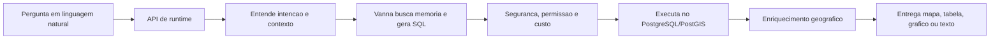
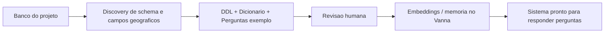

# Roteiro de Apresentacao - NLP2SQL com foco em mapas

## Visao geral

- Duracao estimada: 15 minutos
- Quantidade de slides: 10
- Objetivo da narrativa: mostrar como a estrategia do projeto transforma perguntas em linguagem natural em mapas geograficos e analises territoriais, usando o Vanna como motor de memoria e geracao SQL, com camadas adicionais de seguranca, validacao e entrega multimodal.

---

## Slide 1 - Do texto ao mapa

### O que aparece no slide

- Perguntas em linguagem natural
- Traducao para consulta geografica
- Resposta em mapa, tabela, grafico ou texto

### Fala sugerida

"Esta apresentacao mostra a estrategia que estou usando para construir um sistema de NLP2SQL com foco geografico. A ideia central e simples: a pessoa faz uma pergunta com palavras comuns, como se estivesse conversando, e o sistema transforma isso em uma consulta tecnica ao banco de dados. Mas o objetivo final nao e apenas gerar SQL. O objetivo principal e transformar perguntas em mapas e analises territoriais, de forma acessivel para quem nao domina banco de dados, geoprocessamento ou programacao."

### Diagrama sugerido

`Pergunta em linguagem natural -> Motor NLP2SQL + GEO -> Mapa / tabela / grafico`

---

## Slide 2 - O problema que queremos resolver

### O que aparece no slide

- Bancos geograficos sao complexos
- Consultar exige conhecimento tecnico
- O mapa demora a virar resposta

### Fala sugerida

"Hoje, para transformar uma duvida em mapa, normalmente existe uma cadeia longa. Primeiro alguem precisa entender o banco. Depois descobrir quais tabelas usar. Em seguida escrever SQL. Depois cruzar esse resultado com a geometria correta. E so no final montar a visualizacao. Isso exige um especialista e consome tempo. O problema que tentamos resolver e reduzir essa distancia entre a pergunta humana e a leitura territorial. Em vez de depender de varias etapas manuais, a plataforma concentra esse processo em um fluxo automatizado e controlado."

### Diagrama sugerido

Comparacao lado a lado:

- Hoje: `Usuario -> Analista -> SQL -> GIS -> Mapa`
- Com a plataforma: `Usuario -> Plataforma -> Mapa`

---

## Slide 3 - A logica da solucao

### O que aparece no slide

- Etapa 1: entender o banco
- Etapa 2: publicar memoria no Vanna
- Etapa 3: responder perguntas em producao

### Fala sugerida

"A estrategia do projeto parte de uma ideia importante: o sistema so consegue responder bem se antes aprender o contexto do banco. Por isso a arquitetura foi separada em duas grandes fases. A primeira e a preparacao da base semantica, em que a API investiga a estrutura dos dados e organiza o conhecimento do projeto. A segunda e a publicacao desse conhecimento no Vanna, que passa a funcionar como memoria operacional. So depois disso vem o uso em producao, quando o usuario faz a pergunta e o sistema consegue responder com mais precisao."

### Diagrama sugerido

`Base semantica -> Memoria Vanna -> Perguntas em producao`

### Transicao sugerida

"Entao, antes de falar da pergunta do usuario, eu vou mostrar rapidamente como o sistema se prepara."

---

## Slide 4 - Etapa 1: montagem da base semantica

### O que aparece no slide

- Discovery do schema
- Geracao de DDL, dicionario e perguntas exemplo
- Identificacao de campos geograficos

### Fala sugerida

"Nesta primeira etapa, a API faz uma descoberta automatica do banco. Ela identifica tabelas, colunas, tipos de dados, relacoes e tambem os elementos geograficos, como campos de geometria, SRID e caracteristicas espaciais. A partir disso, ela gera tres artefatos principais. O primeiro e a DDL, que descreve a estrutura do banco. O segundo e o dicionario de dados, que ajuda a explicar o significado funcional de cada parte. O terceiro e um conjunto de perguntas e SQLs de exemplo. Em outras palavras, essa fase constroi uma especie de manual interno do projeto, para que o sistema deixe de ver apenas tabelas soltas e passe a entender o que os dados representam."

### Diagrama sugerido

`Banco PostgreSQL/PostGIS -> Discovery -> DDL + Dicionario + Perguntas`

---

## Slide 5 - Etapa 2: revisao e memoria do Vanna

### O que aparece no slide

- Curadoria humana
- Quality gate
- Embeddings e memoria operacional

### Fala sugerida

"Depois de gerar essa base, o sistema nao coloca tudo em producao automaticamente. Existe uma etapa de revisao, porque em projetos reais o significado dos dados nem sempre pode ser inferido so pela estrutura tecnica. Apos essa curadoria, entra o quality gate, que verifica consistencia, cobertura e qualidade do material gerado. So entao esse conteudo e publicado no Vanna, em forma de memoria e embeddings. Isso e importante porque o Vanna passa a recuperar exemplos parecidos, contexto relevante e padroes de sucesso ja conhecidos. Na pratica, e isso que permite ao sistema responder de forma menos generica e mais aderente ao banco daquele projeto."

### Diagrama sugerido

`Base semantica gerada -> Revisao humana -> Quality gate -> Embeddings no Vanna -> Lab liberado`

### Transicao sugerida

"Com a memoria pronta, ai sim entramos na fase de uso real."

---

## Slide 6 - O que acontece quando a pergunta chega

### O que aparece no slide

- Entender a intencao
- Gerar e comparar SQLs candidatas
- Escolher a melhor consulta

### Fala sugerida

"Quando o usuario faz uma pergunta, o sistema nao pula direto para a execucao. Primeiro ele resolve o contexto da requisicao, identificando o projeto, o usuario e as permissoes. Depois classifica a intencao da entrada, separando o que e uma pergunta analitica do que seria um comando de interface. Em seguida, o Vanna entra em acao para gerar ou adaptar consultas SQL. E aqui ha um ponto tecnico importante: a arquitetura nao depende de uma unica tentativa. Ela pode gerar multiplas SQLs candidatas, comparar aderencia a pergunta, custo estimado e complexidade, e so entao selecionar a melhor opcao. Isso reduz o risco de respostas frageis ou aleatorias."

### Diagrama sugerido

`Pergunta -> Classificacao -> Candidatos SQL -> Selecao`

---

## Slide 7 - Como a plataforma evita erro antes de consultar

### O que aparece no slide

- Seguranca SQL
- Controle de acesso
- Estimativa de custo e execucao sincrona ou em background

### Fala sugerida

"Uma diferenca importante desta abordagem e que ela nao trata o sistema como um chat livre. Depois de escolher a SQL candidata, a plataforma aplica camadas de protecao. Primeiro, valida se a consulta respeita as regras de seguranca e se nao contem comandos indevidos. Depois, verifica o escopo de acesso, para garantir que o usuario so consulte o que pode consultar. E tambem estima o custo da execucao, para decidir se aquela consulta deve rodar imediatamente ou se precisa ir para background. Para um publico leigo, a melhor forma de resumir isso e: a pergunta e livre, mas a execucao e governada."

### Diagrama sugerido

`SQL candidata -> Validacao de seguranca -> Validacao de acesso -> Estimativa de custo -> Executa ou fila`

---

## Slide 8 - Como o resultado vira mapa

### O que aparece no slide

- Resultado tabular com chave geografica
- Enriquecimento com geometria
- Entrega em GeoJSON, MVT ou camada mais robusta

### Fala sugerida

"Este e o coracao do foco geografico. Depois que a consulta roda, o sistema avalia se a resposta tem sinal espacial. As vezes a SQL ja traz a geometria. Em outros casos, ela traz apenas uma chave geografica, como municipio, estado, regiao ou codigo territorial. Nesses casos, o pipeline tenta enriquecer o resultado anexando a geometria correta. Depois ele escolhe a melhor forma de entregar isso. Se o volume for menor, pode usar GeoJSON. Se for intermediario, pode usar MVT. Se for mais pesado ou complexo, pode encaminhar para uma estrategia cartografica mais robusta. Entao o usuario nao recebe apenas numeros: ele recebe uma resposta pronta para leitura espacial."

### Diagrama sugerido

`Resultado -> Detecta chave geografica -> Anexa geometria -> Escolhe formato -> Mapa`

---

## Slide 9 - O que o usuario recebe no final

### O que aparece no slide

- Texto para resumir
- Tabela para detalhar
- Grafico para comparar
- Mapa para interpretar o territorio

### Fala sugerida

"O sistema foi desenhado para ser multimodal. Isso significa que ele pode entregar a resposta em texto, tabela, grafico ou mapa. Mas, no caso deste projeto, o mapa e o foco principal quando a pergunta tem natureza territorial. O texto ajuda a resumir. A tabela ajuda a inspecionar. O grafico ajuda a comparar. E o mapa ajuda a enxergar distribuicao, concentracao e padrao espacial. Essa combinacao e importante porque nem toda decisao nasce apenas de um numero isolado. Muitas vezes, o que importa e perceber onde o fenomeno acontece."

### Diagrama sugerido

Hub central:

- Centro: `Resultado da consulta`
- Saidas: `Texto`, `Tabela`, `Grafico`, `Mapa`

---

## Slide 10 - Fechamento: o valor da estrategia

### O que aparece no slide

- Nao e so NLP2SQL
- E uma camada de traducao entre linguagem humana e territorio
- Com memoria, governanca e resposta espacial

### Fala sugerida

"Para concluir, eu resumiria a estrategia desta forma: o projeto usa o Vanna como nucleo de memoria e geracao SQL, mas constroi em volta dele uma camada propria de preparacao semantica, validacao, seguranca e entrega geografica. Assim, o sistema nao apenas transforma perguntas em consultas. Ele transforma perguntas em leitura territorial. Esse e o ponto principal da proposta: reduzir a barreira tecnica sem abrir mao de controle, precisao e capacidade de explicar o espaco geografico a partir da linguagem natural."

### Fecho final de 20 segundos

"Em uma frase, a proposta e permitir que pessoas pensem em perguntas e recebam mapas, enquanto a complexidade de SQL, contexto do banco e geoprocessamento fica organizada dentro do pipeline."

---

## Diagramas-resumo opcionais

### Diagrama resumo do runtime

### Diagrama resumo do preparo semantico

