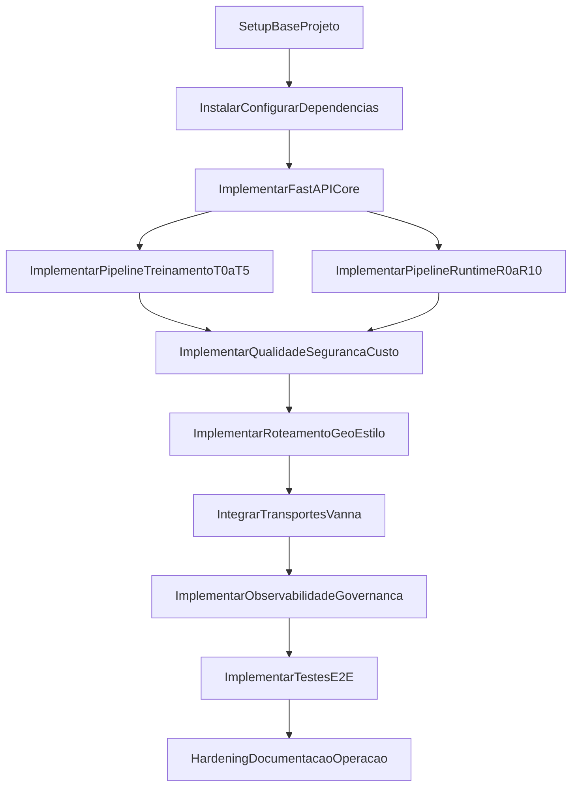

# Plano completo de implementacao do Modulo 1 (api-geo-nlp)

## Escopo e base documental

- Projeto alvo: criar e desenvolver em `[/Users/nti-dev/development/geo-ia-db-master/api-geo-nlp](/Users/nti-dev/development/geo-ia-db-master/api-geo-nlp)`.
- Fonte arquitetural obrigatoria: `[/Users/nti-dev/development/geo-ia-db-master/docs/modulo1.md](/Users/nti-dev/development/geo-ia-db-master/docs/modulo1.md)`.
- Etapa inicial obrigatoria:
  - criar pasta `[/Users/nti-dev/development/geo-ia-db-master/api-geo-nlp/docs](/Users/nti-dev/development/geo-ia-db-master/api-geo-nlp/docs)`;
  - copiar `[/Users/nti-dev/development/geo-ia-db-master/docs/modulo1.md](/Users/nti-dev/development/geo-ia-db-master/docs/modulo1.md)` para `[/Users/nti-dev/development/geo-ia-db-master/api-geo-nlp/docs/modulo1.md](/Users/nti-dev/development/geo-ia-db-master/api-geo-nlp/docs/modulo1.md)`.

## Arquitetura alvo (Vanna 2.0 como motor principal)

- O `Vanna AI 2.0` deve orquestrar o pipeline de agente SQL: `Agent`, `ToolRegistry`, `UserResolver`, `RequestContext`, `Tool Memory` e transportes nativos (`chat_sse`, `chat_websocket`, `chat_poll`).
- O `FastAPI` sera a fronteira unica de API do Modulo 1 (contrato de negocio em `/projects/{project_id}/ask`).
- Os componentes especializados do sistema (extensoes sobre Vanna) serao:
  - `Training Orchestrator`, `Runtime Orchestrator`, `Secure SQL Guard`, `Cost Estimator`, `Geo Routing Engine`, `Result Presentation Planner`, `Lifecycle Governance Hooks`, `Project Artifact Store`.
- Persistencia e infraestrutura:
  - `PostgreSQL + PostGIS` (dados e execucao SQL);
  - `Redis` (cache, fila, estado efemero);
  - engine de workflow (`Temporal` preferencial ou equivalente);
  - armazenamento versionado de artefatos (`filesystem` no inicio com opcao object storage);
  - `Vault/KMS` para `secret_ref` e resolucao segura de credenciais.

## Sequencia de implementacao (macro)

## Estrutura de pastas recomendada

- `[/Users/nti-dev/development/geo-ia-db-master/api-geo-nlp/app](/Users/nti-dev/development/geo-ia-db-master/api-geo-nlp/app)`
- `[/Users/nti-dev/development/geo-ia-db-master/api-geo-nlp/app/api](/Users/nti-dev/development/geo-ia-db-master/api-geo-nlp/app/api)`
- `[/Users/nti-dev/development/geo-ia-db-master/api-geo-nlp/app/core](/Users/nti-dev/development/geo-ia-db-master/api-geo-nlp/app/core)`
- `[/Users/nti-dev/development/geo-ia-db-master/api-geo-nlp/app/modules/training](/Users/nti-dev/development/geo-ia-db-master/api-geo-nlp/app/modules/training)`
- `[/Users/nti-dev/development/geo-ia-db-master/api-geo-nlp/app/modules/runtime](/Users/nti-dev/development/geo-ia-db-master/api-geo-nlp/app/modules/runtime)`
- `[/Users/nti-dev/development/geo-ia-db-master/api-geo-nlp/app/modules/security](/Users/nti-dev/development/geo-ia-db-master/api-geo-nlp/app/modules/security)`
- `[/Users/nti-dev/development/geo-ia-db-master/api-geo-nlp/app/modules/geospatial](/Users/nti-dev/development/geo-ia-db-master/api-geo-nlp/app/modules/geospatial)`
- `[/Users/nti-dev/development/geo-ia-db-master/api-geo-nlp/app/integrations/vanna](/Users/nti-dev/development/geo-ia-db-master/api-geo-nlp/app/integrations/vanna)`
- `[/Users/nti-dev/development/geo-ia-db-master/api-geo-nlp/app/integrations/temporal](/Users/nti-dev/development/geo-ia-db-master/api-geo-nlp/app/integrations/temporal)`
- `[/Users/nti-dev/development/geo-ia-db-master/api-geo-nlp/tests](/Users/nti-dev/development/geo-ia-db-master/api-geo-nlp/tests)`
- `[/Users/nti-dev/development/geo-ia-db-master/api-geo-nlp/docs](/Users/nti-dev/development/geo-ia-db-master/api-geo-nlp/docs)`

## Instalacao e configuracao de frameworks/libs

### Base de aplicacao

- Python 3.11+.
- `fastapi`, `uvicorn[standard]`, `pydantic`, `pydantic-settings`.
- `sqlalchemy`, `psycopg[binary]` (ou `asyncpg` conforme estrategia async).
- `alembic` para migracoes.

### Banco, geoespacial e processamento

- `PostgreSQL + PostGIS` habilitado no ambiente alvo.
- `pandas` ou `polars` para verificacao de resultados.
- `geoalchemy2` para tipos geoespaciais via ORM (se necessario).
- `jenkspy` para classificacao Jenks na fase de estilo cartografico.

### Motor agencial e IA

- `vanna ai 2.0` como motor principal (Agent/ToolRegistry/UserResolver/Memory/transportes).
- libs auxiliares de integracao do Vanna com FastAPI (`VannaFastAPIServer` ou `register_chat_routes`, conforme forma de acoplamento escolhida).
- provedor(es) de LLM configuraveis para fases que exigem inferencia (R1, R2, R6, R8, e opcionalmente T2/T4/R10).

### Seguranca e governanca

- cliente de segredos (`hvac` para Vault ou SDK KMS equivalente).
- `pyjwt`/`authlib` para token e claims (se JWT/OAuth2 no boundary).
- parser/validador SQL: `sqlglot` para bloqueio de comandos e validacao estrutural.
- rate limit e quotas: `slowapi` (ou middleware equivalente) + Redis.

### Background e workflow

- `Temporal` SDK (preferencial) para jobs de treinamento e consultas longas;
- alternativa inicial: `celery` + Redis, mantendo interfaces de orquestracao desacopladas para migracao futura.

### Observabilidade

- `opentelemetry-sdk`, instrumentacao FastAPI/SQL/Redis.
- logs estruturados (`structlog` ou `loguru`) com mascaramento de segredos.
- metricas por projeto/usuario/grupo alinhadas ao modulo1.

### Qualidade e testes

- `pytest`, `pytest-asyncio`, `httpx` (testes de API).
- `testcontainers` (Postgres/PostGIS/Redis locais para teste de integracao).
- checks de dataset: Great Expectations (ou suite de checks customizados) conforme custo/beneficio.

## Implementacao detalhada por fase

### Fase 0 - Bootstrap tecnico

- inicializar projeto Python, lockfile e padroes de lint/format.
- configurar variaveis de ambiente por contexto (`dev`, `hml`, `prod`) sem versionar segredos.
- definir contratos de configuracao para DB, Redis, Vanna, Vault/KMS e workflow engine.

### Fase 1 - API Core e contratos

- expor endpoints de treinamento:
  - `POST /projects/{project_id}/training/discovery`
  - `POST /projects/{project_id}/training/questions:generate`
  - `POST /projects/{project_id}/training/build`
  - `POST /projects/{project_id}/training/publish`
  - `GET /projects/{project_id}/training/jobs/{job_id}`
- expor endpoints de runtime:
  - `POST /projects/{project_id}/ask`
  - `GET /projects/{project_id}/queries/{query_id}`
- definir DTOs Pydantic para `request_context`, politicas de execucao e payload multimodal.

### Fase 2 - Pipeline A (Treinamento T0 a T5)

- T0: resolver `project_id`, `secret_ref` e autorizacao administrativa.
- T1: descoberta automatica de metadados (DDL, dicionario, dominios, perfil geoespacial, SRID, unidade, projecao).
- T2: construir `ddl.md`, `dictionary.md`, `questions.md` (>=50 Q&A SQL) com guia PostGIS por projecao.
- T3: publicar corpus no Tool Memory e memorias textuais auxiliares, com metadados (`project_id`, `dataset_version`, timestamp, score).
- T4: gate de qualidade (completude, consistencia, validacao SQL basica).
- T5: ativar versao e registrar auditoria.

### Fase 3 - Pipeline B (Runtime R0 a R10)

- R0: normalizar `RequestContext` e resolver identidade/grupos com `UserResolver`.
- R1: classificar intencao (UI command vs SQL analitico).
- R2: gerar/adaptar SQL com busca em memoria do Vanna.
- R3: aplicar `Secure SQL Guard` (allowlist/denylist, escopo por projeto e politicas por usuario/grupo).
- R4: estimar custo via `EXPLAIN (FORMAT JSON)` e decidir `sync` ou `background`.
- R5: executar SQL com isolamento e validacoes minimas de integridade.
- R6: planejar resposta multimodal (texto/tabela/grafico/mapa).
- R7: rotear geoespacial (A GeoJSON leve / C MVT / B GeoServer).
- R8: gerar estilo cartografico (Leaflet style JSON ou perfil SLD) com Jenks quando aplicavel.
- R9: entregar payload final (incluindo streaming SSE/WebSocket/Polling quando negociado).
- R10: aprender continuamente (persistir interacoes bem-sucedidas no Tool Memory).

### Fase 4 - Integracao nativa do Vanna 2.0

- integrar `POST /projects/{project_id}/ask` ao `Vanna Transport Adapter`.
- habilitar transportes nativos:
  - `POST /api/vanna/v2/chat_sse`
  - `WebSocket /api/vanna/v2/chat_websocket`
  - `POST /api/vanna/v2/chat_poll`
- manter contrato de negocio estavel (`/ask`) e expor nativos como canal complementar.

### Fase 5 - Isolamento por projeto e armazenamento de artefatos

- adotar estrutura versionada:
  - `/training/{project_id}/{dataset_version}/ddl.md`
  - `/training/{project_id}/{dataset_version}/dictionary.md`
  - `/training/{project_id}/{dataset_version}/questions.md`
  - `/training/{project_id}/{dataset_version}/manifest.json`
- garantir segregacao logica de memoria por projeto e contexto de usuario/grupo.

### Fase 6 - Integracoes inter-modulos

- Modulo 3 -> Modulo 1: cadastro de projeto/banco e disparo de treinamento.
- Modulo 2 -> Modulo 1: envio de pergunta/comando + contexto de usuario.
- Modulo 1 -> Modulo 2: retorno multimodal + metadados geoespaciais e estilo.
- Modulo 1 -> Modulo 4: delegacao da Rota B (alto volume/complexidade).

### Fase 7 - Observabilidade, auditoria e custo

- instrumentar latencia p95/p99, memory hit util, taxa de fallback para background, distribuicao de rotas A/C/B.
- registrar auditoria por `project_id`, `user_id`, `group`, ferramenta executada, dataset_version.
- mascarar segredos e impedir vazamento de credenciais em log/payload.

### Fase 8 - Testes e criterios de aceite

- testes unitarios por componente critico (router, sql guard, cost estimator, geo routing, style planner).
- testes de integracao com PostGIS/Redis/Vanna memory.
- testes E2E cobrindo:
  - fluxo de treinamento completo (T0->T5);
  - fluxo de runtime completo (R0->R10);
  - consultas geoespaciais em Rota A, C e B;
  - execucao sync e background;
  - comandos de UI sem SQL.
- criterios minimos: endpoints estaveis, bloqueio de SQL insegura, roteamento geoespacial correto, estilo cartografico presente em resposta geografica, auditoria ativa.

## Ordem recomendada de entrega (milestones)

- M1: scaffold + docs + contratos de API + config base.
- M2: pipeline de treinamento T0-T5 funcional com publicacao de dataset.
- M3: runtime R0-R5 (ask robusto com seguranca e custo).
- M4: runtime R6-R10 + multimodal + rotas geo + estilo.
- M5: transportes nativos Vanna + observabilidade completa + hardening + testes E2E.

## Riscos e mitigacoes

- Ambiguidade de SQL gerada por LLM: mitigar com memoria por projeto, validação deterministica e datasets curados.
- Custo alto em queries espaciais: mitigar com gate de custo, thresholds e roteamento A/C/B.
- Vazamento de credencial: mitigar com `secret_ref`, Vault/KMS e redacao de logs.
- Regressao em runtime multimodal: mitigar com testes de contrato e snapshots de payload.
