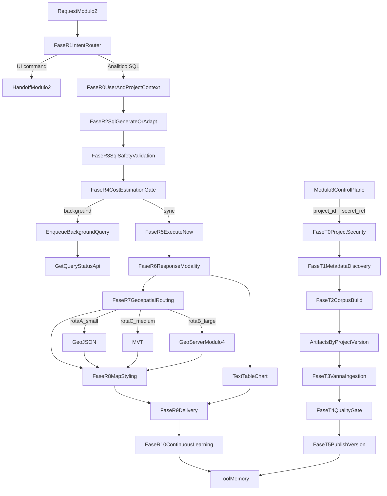

# Modulo 1 - API Core Text-to-SQL (Arquitetura Completa)

## 1. Objetivo do modulo

O Modulo 1 e o coracao da arquitetura. Ele centraliza:

- treinamento automatico por projeto;
- runtime de perguntas em linguagem natural;
- seguranca, governanca e controle de custo;
- orquestracao de saida multimodal (texto, tabela, grafico, mapa).

Este documento esta em nivel arquitetural, com foco em fases, responsabilidades e integracoes entre modulos.

---

## 2. Revisao critica do plano original

### 2.1 Pontos fortes

- Definiu bem o Modulo 1 como nucleo do sistema.
- Introduziu fases criticas de roteamento, seguranca e custo.
- Trouxe preocupacao real com geoespacial em escala.
- Ja conectava o modulo aos demais (Modulo 2, 3 e 4).

### 2.2 Lacunas que precisavam ser corrigidas

- Pipeline de treinamento do Vanna 2.0 estava pouco operacionalizado no Modulo 1.
- Contratos de API de treinamento por `project_id` nao estavam claros.
- Isolamento de datasets por projeto e versionamento sem formalizacao.
- Troca segura de credenciais Modulo 3 -> Modulo 1 sem padrao definido.
- Fases de runtime (intencao, validacao SQL, custo, modalidade e georoteamento) estavam incompletas na versao anterior do documento.

---

## 3. Papel do Vanna AI 2.0 no Modulo 1

O Vanna AI 2.0 e o framework principal de agente SQL no modulo, com:

- `Agent` para orquestrar raciocinio e uso de ferramentas;
- `ToolRegistry` para registrar ferramentas com controle de acesso;
- `UserResolver` para identidade, grupos e autorizacao;
- `Tool Memory` para reaproveitar interacoes corretas;
- fluxo nativo:
  - pergunta similar -> busca memoria -> adapta SQL -> executa variante;
  - pergunta nova -> investigacao profunda -> gera SQL -> executa e valida -> salva memoria.

### 3.1 O que e nativo do Vanna vs extensao do sistema

**Nativo/coberto pelo Vanna 2.0**
- agente + tools + memoria + permissoes por usuario/grupo;
- adaptacao de consultas com base em historico de sucesso.

**Extensao arquitetural deste sistema**
- descoberta automatica de metadados do banco por projeto;
- geracao de artefatos `ddl.md`, `dictionary.md`, `questions.md`;
- validacao de seguranca SQL e gate de custo pre-execucao;
- politica de execucao foreground vs background;
- roteamento geoespacial A/C/B (GeoJSON, MVT, GeoServer);
- contrato multimodal para UI (texto, tabela, grafico, mapa).

---

## 4. Arquitetura alvo do Modulo 1

### 4.1 Componentes principais

- **API Core (FastAPI)**: fronteira unica do Modulo 1.
- **Intent Router**: classifica intencao (SQL analitico vs comando de UI).
- **Runtime Orchestrator**: coordena fases de runtime e trilha de auditoria.
- **Training Orchestrator**: coordena jobs de treinamento por projeto.
- **Security Context Service**: resolve usuario/perfil/projeto com `UserResolver`.
- **Secure SQL Guard**: valida seguranca e conformidade da SQL antes da execucao.
- **Cost Estimator**: estima custo de execucao e define politica sync/background.
- **Result Presentation Planner**: decide formato de resposta.
- **Geo Routing Engine**: decide GeoJSON, MVT ou GeoServer por volume/complexidade.
- **Vanna Integration Layer**: integra Agent, ToolRegistry e Tool Memory.
- **Project Artifact Store**: persiste datasets por projeto e versao.

### 4.2 Tecnologias e frameworks (arquitetural)

- Vanna AI 2.0;
- FastAPI;
- PostgreSQL/PostGIS;
- Redis (cache/fila);
- Temporal ou runner de workflow equivalente;
- armazenamento versionado (filesystem ou object storage);
- Vault/KMS para segredos.

---

## 5. Pipeline A - Treinamento automatico por projeto

### Fase T0 - Contexto de projeto e seguranca

- recebe `project_id`;
- resolve `secret_ref` de forma segura;
- valida permissoes administrativas para treinamento.

### Fase T1 - Descoberta automatica de metadados

- extrai DDL por schema/tabela;
- extrai metadados de dicionario;
- extrai dominios por coluna (valores possiveis, cardinalidade, exemplos);
- executa investigacao geoespacial para cada tabela/campo geografico:
  - identifica tipo (`geometry` ou `geography`);
  - identifica SRID e unidade esperada (graus vs metros);
  - classifica projecao de trabalho (geografica/global vs projetada, como UTM);
  - registra implicacoes de desempenho e precisao para consultas espaciais.

### Fase T2 - Construcao de corpus

- gera `ddl.md`;
- gera `dictionary.md`;
- anexa ao `dictionary.md` uma matriz de recomendacao de funcoes PostGIS por tipo de projecao detectada, por exemplo:
  - em dados geograficos (graus/global): preferir `::geography` para metricas em metros;
  - em dados projetados/UTM (metros): preferir calculos em `geometry` para maior performance;
  - para filtros de proximidade: priorizar `ST_DWithin` antes de `ST_Distance` em predicados;
  - quando necessario: indicar `ST_Transform` para transformar antes de medir area/distancia/comprimento;
- gera `questions.md` com no minimo 50 pares pergunta/resposta SQL.

### Fase T3 - Ingestao no Vanna

- converte corpus para contexto de treino do agente;
- publica no Tool Memory;
- associa dataset a `project_id` e `dataset_version`.

### Fase T4 - Gate de qualidade

- verifica completude, consistencia e cobertura;
- valida SQLs de exemplo em nivel sintatico/semantico basico;
- aprova ou reprova publicacao.

### Fase T5 - Publicacao do dataset

- marca versao ativa do projeto;
- registra auditoria de publicacao.

---

## 6. Pipeline B - Runtime de perguntas em producao

### Fase R0 - Entrada e contexto de usuario

- recebe chamada `ask` com `project_id` + contexto de usuario;
- aplica `UserResolver` para obter identidade e grupos;
- carrega regras de acesso ao conteudo do banco.

### Fase R1 - Classificacao de intencao (faltava e agora e obrigatoria)

- classifica a entrada em:
  - **comando de UI** (nao executa SQL);
  - **pergunta analitica SQL**.
- se for comando de UI: devolve handoff para Modulo 2;
- se for SQL: segue para fases de inferencia.

### Fase R2 - Geracao/adaptacao SQL com Vanna

- busca similaridade no Tool Memory;
- se encontrar padrao: adapta SQL conhecida;
- se nao encontrar: gera SQL nova por investigacao de contexto.

### Fase R3 - Validacao de SQL e seguranca (faltava explicitar)

- aplica politicas de seguranca antes da execucao:
  - bloqueio de comandos nao permitidos;
  - validacao de escopo de schema/tabela por projeto;
  - reforco de regras de acesso por usuario/grupo.
- em caso de falha: retorna erro governado e nao executa consulta.

### Fase R4 - Estimativa de custo e politica de execucao (faltava explicitar)

- estima custo com plano de execucao antecipado;
- decide politica:
  - **execucao sincrona** para consultas leves/moderadas;
  - **execucao em background** para consultas pesadas/lentas;
- comunica ao usuario o modo escolhido e status.

### Fase R5 - Execucao e verificacao

- executa a SQL no banco do projeto;
- valida integridade basica da resposta;
- produz dados estruturados para etapa de apresentacao.

### Fase R6 - Planejamento de apresentacao multimodal (faltava explicitar)

- define formato(s) de resposta:
  - texto;
  - tabela;
  - grafico (tipos sugeridos conforme dados: barra, linha, pizza, dispersao, etc.);
  - mapa geografico.
- gera metadados de renderizacao para Modulo 2.

### Fase R7 - Roteamento geoespacial por volume (faltava explicitar)

- detecta se ha geometria/geografia no resultado;
- decide rota:
  - **Rota A - GeoJSON leve**: baixo volume;
  - **Rota C - MVT**: volume intermediario;
  - **Rota B - GeoServer (Modulo 4)**: alto volume/complexidade.

### Fase R8 - Planejamento e geracao de estilo cartografico (obrigatoria para resposta geografica)

- fase obrigatoria sempre que o resultado for geografico;
- identifica o tipo de geometria predominante (ponto, linha, poligono, multiparte);
- analisa natureza dos atributos para simbolizacao:
  - categorico, quantitativo continuo, quantitativo discreto, densidade;
- define estrategia de estilo:
  - estilo para Leaflet (GeoJSON/MVT) quando resposta e no Modulo 2;
  - estilo SLD quando resposta depende do GeoServer (Modulo 4);
- decide quando aplicar classificacao estatistica por **Jenks** para gerar faixas tematicas relevantes;
- gera metadados de legenda, rampa de cor, opacidade, espessura/tamanho e regras de rotulo.

### Fase R9 - Entrega de resposta

- retorna payload multimodal final para Modulo 2;
- quando geografico, retorna tambem payload de estilo (leaflet-style-json ou SLD-profile);
- se background: retorna `query_id` e canal de acompanhamento.

### Fase R10 - Aprendizado continuo

- salva interacoes bem-sucedidas no Tool Memory;
- atualiza metricas de qualidade por projeto.

---

## 7. Contratos de API (arquitetural)

### 7.1 APIs de treinamento por projeto

- `POST /projects/{project_id}/training/discovery`
- `POST /projects/{project_id}/training/questions:generate`
- `POST /projects/{project_id}/training/build`
- `POST /projects/{project_id}/training/publish`
- `GET /projects/{project_id}/training/jobs/{job_id}`

### 7.2 APIs de runtime

- `POST /projects/{project_id}/ask`
  - recebe pergunta + contexto de usuario para `UserResolver`;
  - permite politica de execucao (`sync` ou `background`);
  - retorna metadados de modalidade de resposta, estrategia geoespacial e perfil de estilo cartografico quando aplicavel.

- `GET /projects/{project_id}/queries/{query_id}`
  - consulta status/progresso/resultado de execucao em background.

---

## 8. Isolamento de projeto e seguranca de conexao

### 8.1 Armazenamento por projeto

Estrutura recomendada:

`/training/{project_id}/{dataset_version}/`

Arquivos obrigatorios:

- `ddl.md`
- `dictionary.md`
- `questions.md`
- `manifest.json`

### 8.2 Compartilhamento seguro Modulo 3 -> Modulo 1

- Modulo 3 salva credenciais no cofre e compartilha apenas `secret_ref`;
- Modulo 1 resolve segredo em runtime com identidade de servico;
- senha nao aparece em logs, payloads ou UI;
- rotacao de segredo e principio de minimo privilegio sao obrigatorios.

---

## 9. Integracao com outros modulos

- **Modulo 3 -> Modulo 1**: cria projeto, registra banco, dispara treinamento.
- **Modulo 2 -> Modulo 1**: envia pergunta/comando e contexto do usuario.
- **Modulo 1 -> Modulo 2**: retorna resposta multimodal e estado da consulta.
- **Modulo 1 -> Modulo 4**: delega rendering geoespacial pesado (Rota B).

---

## 10. Observabilidade e governanca

Metricas recomendadas por projeto:

- latencia p95/p99 de `ask`;
- taxa de acerto em primeira resposta;
- taxa de reaproveitamento do Tool Memory;
- taxa de fallback para background;
- taxa de roteamento A/C/B em geoespacial;
- taxa de aplicacao de estilos por tipo de geometria;
- taxa de uso de classificacao Jenks em respostas geograficas;
- taxa de sucesso de jobs de treinamento.

---

## 11. Fluxo arquitetural consolidado

---

## 12. Decisoes arquiteturais finais

1. O Modulo 1 concentra treinamento e runtime, com trilhas separadas.
2. A fase de classificacao de intencao e obrigatoria no runtime.
3. SQL sempre passa por validacao de seguranca e gate de custo antes de executar.
4. Execucao pode ser sincrona ou background, conforme custo previsto.
5. A resposta e multimodal e inclui plano de visualizacao.
6. Dados geoespaciais seguem roteamento A/C/B por volume e complexidade.
7. Toda resposta geografica passa obrigatoriamente por uma fase de geracao de estilo cartografico.
8. O FastAPI e o gerenciador principal de requisicoes e respostas do Modulo 1.
9. O Vanna AI 2.0 e o orquestrador principal do fluxo agencial do modulo.
10. As fases geoespaciais e de governanca sao extensoes especializadas do backend.

---

## 13. Tabela de implementacao por fase (frameworks, componentes e LLM)

| Fase | Objetivo da fase | Frameworks/Tecnologias principais | Componente/funcao especifica | Inferencia com LLM |
|---|---|---|---|---|
| Camada transversal | Governar entrada, saida e orquestracao global do modulo | FastAPI, Vanna AI 2.0, OpenTelemetry, Redis | `FastAPI API Core` (gateway), `Vanna Agent` (orquestrador), middleware de observabilidade | Nao obrigatoria (camada de controle) |
| T0 - Contexto de projeto e seguranca | Resolver projeto, credenciais e autorizacao de treinamento | FastAPI, Vault/KMS, Vanna `UserResolver` | `ProjectContextResolver`, `SecretResolver`, `AccessPolicyEvaluator` | Nao (deterministico/regra) |
| T1 - Descoberta de metadados | Extrair DDL, dicionario, dominios e contexto geoespacial (SRID/unidade/projecao) | PostgreSQL/PostGIS (`geometry_columns`, `spatial_ref_sys`), SQLAlchemy, pandas | `MetadataDiscoveryService`, `SchemaIntrospector`, `DomainProfiler`, `SpatialProjectionProfiler` | Opcional para normalizar descricoes de dicionario (modelo pequeno) |
| T2 - Construcao de corpus | Gerar `ddl.md`, `dictionary.md`, `questions.md` (>=50 Q&A SQL) + guia de funcoes PostGIS por projecao | Vanna AI 2.0, Jinja2/templating, object storage | `CorpusBuilder`, `QuestionSqlGenerator`, `ArtifactWriter`, `PostgisFunctionGuidanceBuilder` | Sim. Recomendado: Claude Sonnet 4.5 ou GPT-4.1 |
| T3 - Ingestao no Vanna | Publicar corpus no Tool Memory e contexto do agente | Vanna `ToolRegistry`, `SaveQuestionToolArgsTool`, `SearchSavedCorrectToolUsesTool` | `TrainingPublisher`, `ToolMemoryIndexer` | Nao obrigatoria |
| T4 - Gate de qualidade | Validar completude, consistencia e cobertura do dataset | Great Expectations (ou checks custom), SQL parser (`sqlglot`) | `DatasetQualityGate`, `SqlExampleValidator` | Opcional para classificar qualidade semantica (modelo medio) |
| T5 - Publicacao do dataset | Ativar dataset do projeto e registrar auditoria | FastAPI, PostgreSQL (metadados), OpenTelemetry | `DatasetActivationService`, `PublicationAuditLogger` | Nao |
| R0 - Entrada e contexto de usuario | Ler pergunta e contexto de usuario/projeto | FastAPI, Vanna `UserResolver`, JWT/OAuth2 | `AskRequestHandler`, `UserContextResolver` | Nao |
| R1 - Classificacao de intencao | Decidir se entrada e comando UI ou consulta SQL | Vanna Agent, cache Redis | `IntentRouterAgent` | Sim. Recomendado: Claude Haiku 4.5 ou GPT-4o mini (baixa latencia) |
| R2 - Geracao/adaptacao SQL | Reaproveitar memoria ou gerar SQL nova | Vanna Tool Memory + `RunSqlTool` | `SqlPlannerAgent`, `MemoryRetriever` | Sim. Recomendado: Claude Sonnet 4.5 ou GPT-4.1 |
| R3 - Validacao de SQL e seguranca | Bloquear SQL insegura e aplicar politicas de acesso | `sqlglot`, regras RBAC/RLS, allowlist/denylist | `SqlSecurityGuard`, `PolicyEnforcer` | Opcional para remediacao assistida; validacao principal deve ser deterministica |
| R4 - Estimativa de custo e politica de execucao | Definir sync vs background antes de executar | PostgreSQL `EXPLAIN (FORMAT JSON)`, Celery/RQ com Redis (ou Temporal) | `CostEstimator`, `ExecutionPolicyDecider`, `BackgroundDispatcher` | Nao |
| R5 - Execucao e verificacao | Executar SQL e validar retorno | PostgreSQL/PostGIS, pandas/polars | `SqlExecutionService`, `ResultSanityChecker` | Nao |
| R6 - Planejamento multimodal | Definir resposta: texto, tabela, grafico ou mapa | Vanna `VisualizeDataTool`, Plotly schema, contrato JSON | `ResponseModalityPlanner`, `ChartTypeSelector` | Sim. Recomendado: Claude Sonnet 4.5 ou GPT-4.1 (com fallback heuristico) |
| R7 - Roteamento geoespacial | Escolher GeoJSON, MVT ou GeoServer por volume | PostGIS (`ST_AsGeoJSON`, `ST_AsMVT`), GeoServer, GeoWebCache | `GeoRoutingEngine`, `TileStrategySelector` | Nao (decisao por regras/thresholds) |
| R8 - Estilizacao cartografica | Gerar estilo para Leaflet ou SLD para GeoServer, com Jenks quando aplicavel | `jenkspy`, GeoPandas/mapclassify (opcional), SLD builder, ColorBrewer/Mapbox style spec | `GeoStylePlanner`, `JenksClassifier`, `LeafletStyleComposer`, `SldStyleComposer` | Sim. Recomendado: Claude Sonnet 4.5 para sugestao semantica de estilo (com guardrails deterministicos) |
| R9 - Entrega da resposta | Retornar payload final, estado de execucao e metadados de estilo | FastAPI, SSE/WebSocket | `ResponseAssembler`, `StreamingNotifier`, `QueryStatusApi`, `StylePayloadAdapter` | Nao |
| R10 - Aprendizado continuo | Salvar interacoes bem-sucedidas no Tool Memory | Vanna Tool Memory, observabilidade | `LearningFeedbackService`, `MemoryWriter` | Opcional para curadoria automatica de exemplos |
